# Office 365: Security Optimisation Assessment Power BI Dashboard Deployment Guide

__[[TOC]]__

## Disclaimer

The Sample Template is provided for the purpose of illustration only. THIS SAMPLE TEMPLATE AND ANY RELATED INFORMATION ARE PROVIDED "AS IS" WITHOUT WARRANTY OF ANY KIND, EITHER EXPRESSED OR IMPLIED, INCLUDING BUT NOT LIMITED TO THE IMPLIED WARRANTIES OF MERCHANTABILITY AND/OR FITNESS for A PARTICULAR PURPOSE.  We grant You a non-exclusive, royalty-free right to use and modify the Sample Template and to reproduce and distribute the object code form of the Sample Template, provided that You agree: (i) to not use Our name, logo, or trademarks to market Your software product in which the Sample Template is embedded; (ii) to include a valid copyright notice on Your software product in which the Sample Template is embedded; and (iii) to indemnify, hold harmless, and defend Us and Our suppliers from and against any claims or lawsuits, including attorneys’ fees, that arise or result from the use or distribution of the Sample Template.

## Overview

This document describes the steps required to deploy the Office 365 Security Optimisation Assessment (SOA) Power BI dashboard using the provided template. The dashboard provides a view of the assessment results, a simplified experience to plan remediation activities, and a way to track remediation over time.

## Requirements

* Power BI Desktop [Get Power BI Desktop](https://docs.microsoft.com/en-us/power-bi/fundamentals/desktop-get-the-desktop)
* SOA Power BI Dashboard template (O365 Security PBI Dashboard.pbit)
* SOA Remediation Planning Spreadsheet (RPS) workbook created from a SOA engagement in April 2022 or later, stored in a SharePoint Online or OneDrive for Business document library

## Create Power BI Dashboard using template

The Power BI dashboard template requires a Remediation Planning Spreadsheet (RPS) workbook from an Office 365 Security Optimisation Assessment delivery from April 2022 or later. The RPS must be stored in a document library in SharePoint Online or OneDrive for Business. (The document library can be synchronised to a local machine for ease of editing the RPS). The RPS filename is **Contoso – O365 Security Remediation Planning.xlsx**, where **Contoso** is the organisation name used by the SOA delivery engineer as a prefix for the deliverables. For Power BI Desktop to be able to open the RPS, you will need a “direct link” to the document.  It can be obtained using the following steps:

1.	In a web browser, open the SharePoint Online or OneDrive for Business document library or where the RPS is stored
2.	Click on the **ellipsis** icon next to the name of the RPS file and click on **Details**
3.	In the details pane on the right, scroll down to the **More Details** section and click the Copy icon next to **Path** to add the link to the clipboard

The direct link will look like this if is stored in OneDrive for Business:

`https://contoso-my.sharepoint.com/personal/user_contoso_com/Documents/Contoso%20-%20O365%20Security%20Remediation%20Planning.xlsx`

If this is your first-time launching Power BI Desktop you will need to sign in first. Click the **Get started** button, enter your email address and click **Continue**. Complete the sign in process and confirm that your name is present in the title bar. Next click **File** and then click **Get started** before proceeding with the following steps:

1.	At the Power BI Desktop startup screen, click **Open other reports**
2.	Change the file extension drop-down to **Power BI template files (*.pbit)**
3.	Navigate to and select the template file (O365 Security PBI Dashboard.pbit) provided by the SOA engineer and click **Open**

    ***Note:** If you receive a message saying “Unable to open document. The queries were authored with a newer version of Power BI Desktop and may not work with your version.”, it is recommended that you update to the latest version of Power BI Desktop, though you will still be able to continue with the current version.*

4.	When prompted for the **SharePointURL**, paste the direct link you obtained from above and click **Load**
5.	Once the report has been created, click **File**, then **Save As**
6.	Specify a file name, for example **Contoso – SOA Dashboard.pbix**, and click **Save**

## Publishing the Power BI Dashboard

Publishing a Power BI dashboard makes it available to others within the organisation to be able to consume. Because the data used by the dashboard is being loaded from an Excel spreadsheet, any time updates are made, such as marking a control remediated, the dashboard will need to be refreshed and republished to view the updated data.
To publish your dashboard, use the following steps:

1.	In Power BI Desktop, click Home and then click **Publish**
2.	In the **Publish to Power BI** window, select the workspace you wish to publish to and click Select
3.	Optional: If you are republishing the report, you may be prompted to replace the existing dataset, so click **Replace**
4.	Click the link presented to open the published dashboard in a browser

To optionally share your dashboard with others inside your organisation, perform the following steps:

1.	Open the dashboard in a browser and click **Share**
2.	From the **Share Link** window, ensure **Specific People** is selected, and it is recommended that both **Allow recipients to share this report** and **Allow recipients to build content with the data associated with this report** are not checked (because of the sensitivity of the content)
3.	Enter the email addresses of the individuals with whom you want to share
4.	Enter an Optional message
5.	Click **Send** to share the report

## Overview of Dashboard Functionality

The Power BI Dashboard consists of multiple tabs (pages) which contain filters and charts to provide users views of the SOA results and remediation progress. Additionally, there are several bookmarks and buttons to navigate between tabs or switch between charts on a given tab.

### Intruduction Tab

The **Introduction** tab is a landing page for the dashboard and will show you who performed the assessment for your organisation and the date of the assessment.

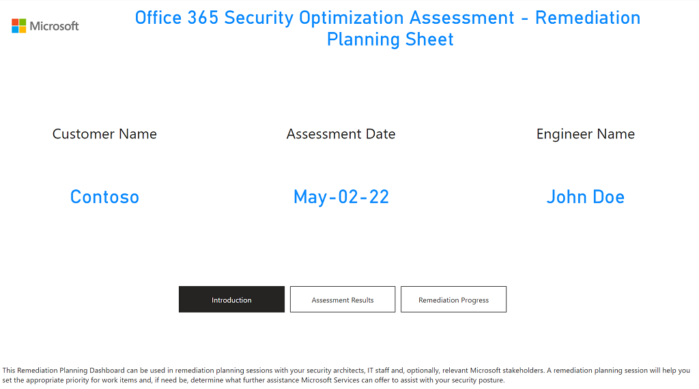

### Assessment Results Tab

At the bottom of this tab, you will find buttons that can be used to navigate to the **Assessment Results** or **Remediation Progress** tabs. (In Power PI Desktop, you must use Ctrl+click to use the buttons.) Alternately, you can use the tabs within Power BI to navigate between them.

On the Assessment Results tab, you will find details of the results from the SOA:

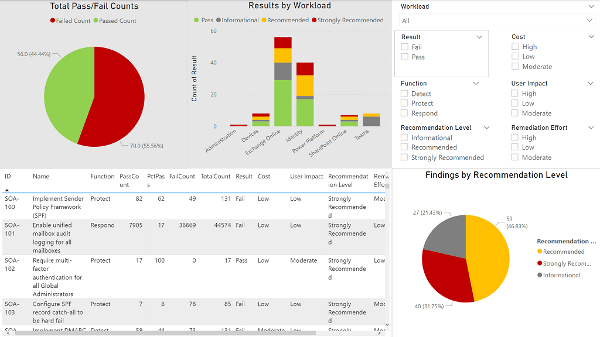

The tab has three main sections:

* **Overall results:** The chart on the top left provides a view of total passing/failing controls from the assessment. The chart on the right shows the results by workload and broken down by recommendation level.  (These charts will not update when you use the filters, so they have a grey background to help differentiate these charts from the detailed results.)

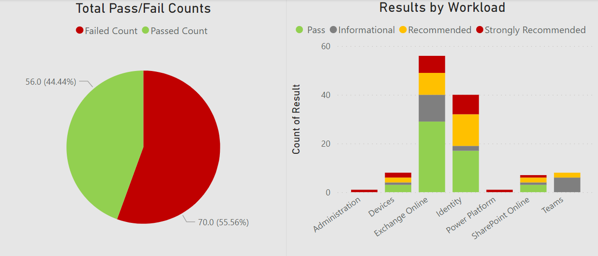

* **Results filters:** These filters can be used to show different views in the Detailed Findings section of this tab. For example, if you want to identify which controls are aligning with the Protect function/pillar, you would click Protect under Function to show only those details in the Detailed Findings section.

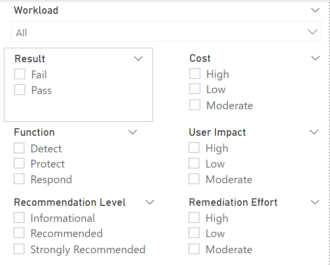

* **Detailed Findings:** This section will show results based on the current filter.

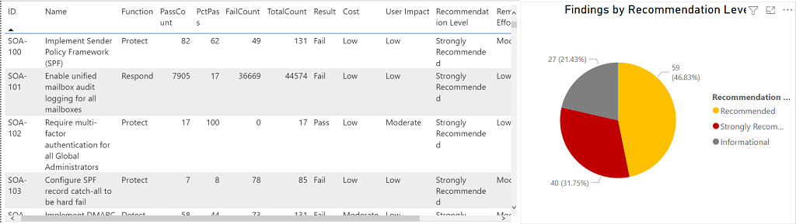

### Remediation Progress Tab

On the **Remediation Progress** tab, you can track your remediation efforts as well as plan future remediation activities:

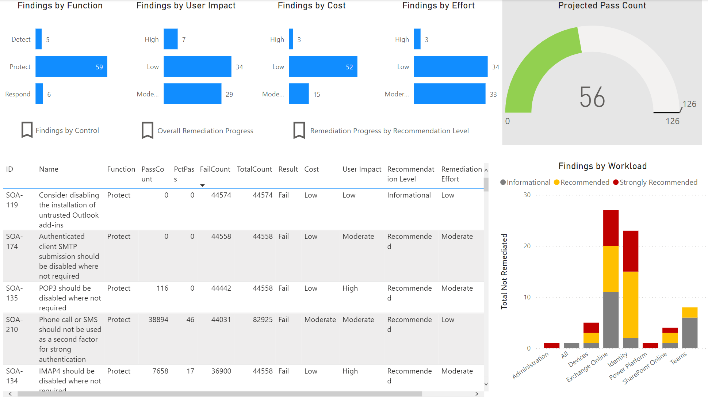

The bar charts across the top row display the number of controls that have not been remediated (aka Findings), broken down by different categories: Cybersecurity Function, User Impact, Cost or Remediation Effort:

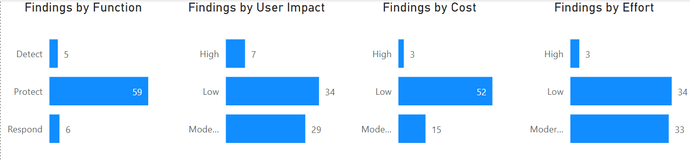

In the top right corner, you will see the number of controls projected to pass a subsequent SOA, represented by a gauge chart:

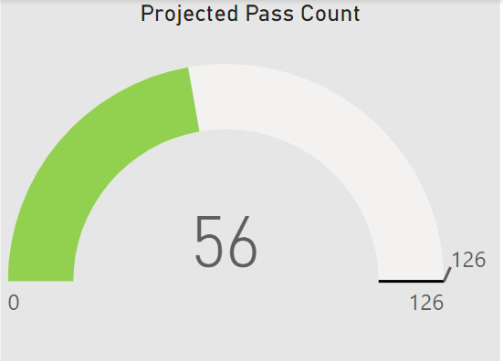

At the bottom-right corner of the screen, you will a see a chart showing the number of controls pending remediation, broken down by recommendation level and technology workload:

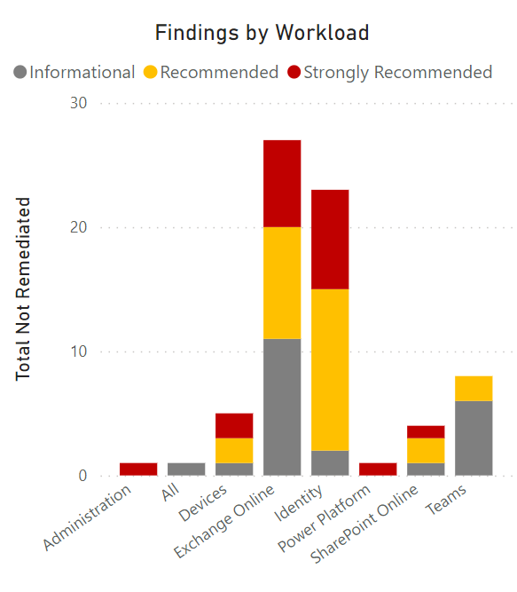

Below the bar charts at the top are three bookmarks allowing you to navigate between different views showing the remaining controls to remediate or remediation progress. (Remember to use Ctrl+click to activate a bookmark in Power BI Desktop.)

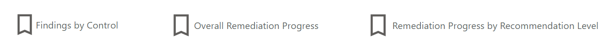

The Findings by Control bookmark will display a table of the control details that have yet to be remediated:

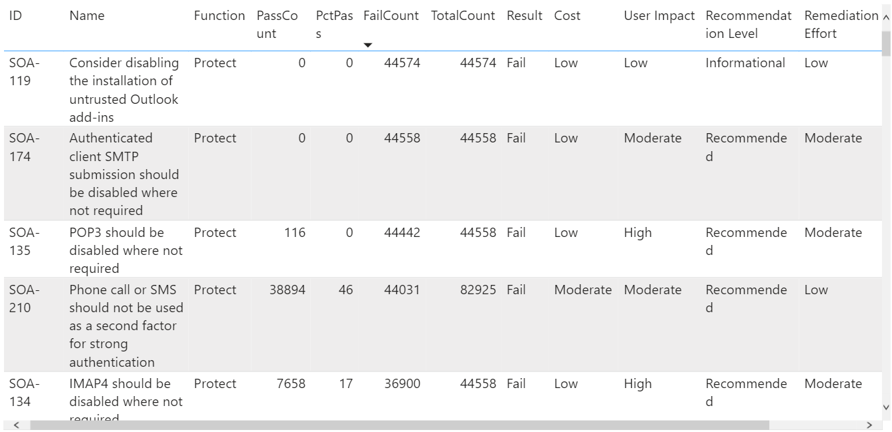

The **Overall Remediation Progress** bookmark will display a chart showing how many items have been remediated over time (based on controls marked as remediated, as detailed in Tracking Remediation Progress section of this document):

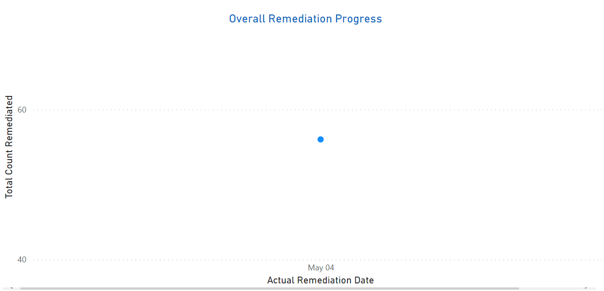

The **Remediation Progress by Recommendation Level** bookmark will display a chart similar to the Overall Remediation Progress chat but broken down by recommendation level:

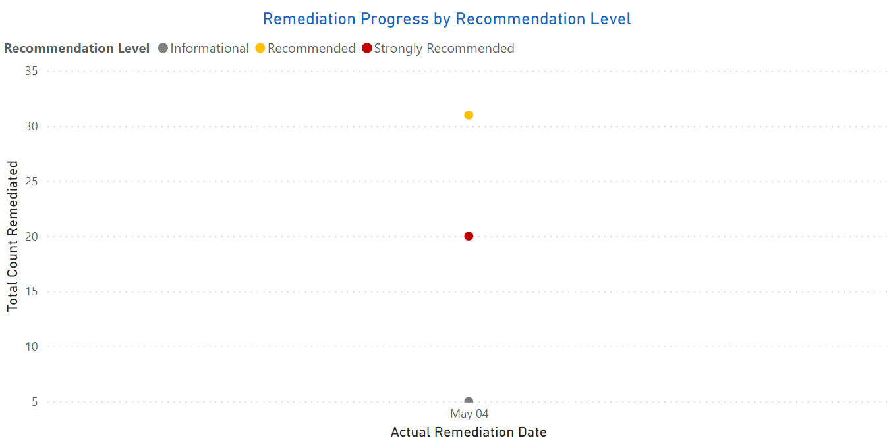

You can click on any bar in the top-row bar charts or any recommendation level in any column in the column chart and all the charts (except the gauge chart of project pass count) and table of controls will be filtered accordingly.

## Tracking Remediation Progress

The Remediation Progress tab can be used to track remediation progress over time against the original SOA results. The Actual Remediation Date column in the RPS is used to determine the date that a given control was confirmed to be remediated or remediation has been completed. This field will already be populated with the date the SOA analysis was performed for all controls with a result of Pass. When you have remediated a control based on the recommendations from the SOA, you can populate the **Actual Remediation Date** field of that control with the remediation date in the format YYYY-MM-DD.

**Notes:**
* Do not change the Result field to Pass.
* Do not add any columns between A-V, inclusive.  You may use columns W-Z for any usage you want, but no more, as column AA is used by the dashboard.

To update the charts on the **Remediation Progress** tab in the Power BI dashboard, ensure that the RPS file that is being used to generate the content has been saved and closed. Because the Power BI dashboard represents a static copy of the data, you will need to perform the following steps:

1.	If not already running, start Power BI Desktop
2.	Open the saved .pbix file for the dashboard you created
3.	In the tools Ribbon, click **Home**, and then click **Refresh**. (If the dashboard is already open, you can simply click Refresh.)

This will refresh the data from the updated RPS and the now-remediated controls will be reflected in the various charts on the Remediation Progress tab. Below are examples showing progress over time:

* Overall Remediation Progress

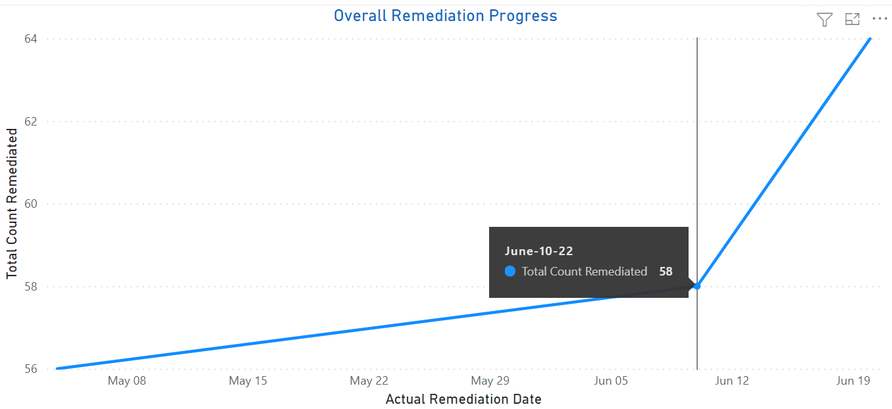
 
* Remediation Progress by Recommendation Level

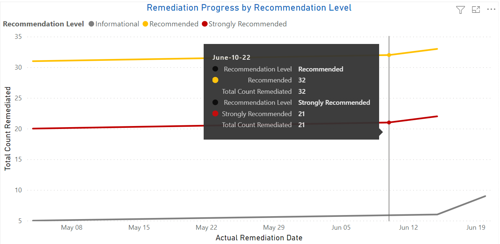